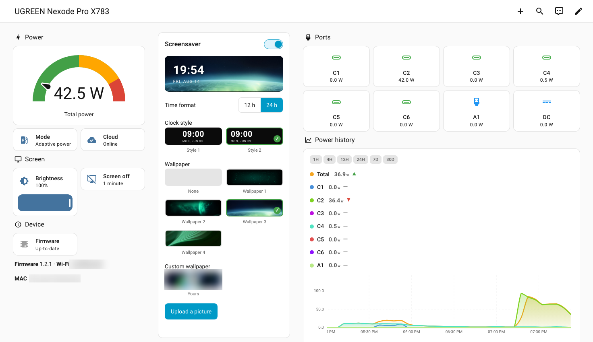
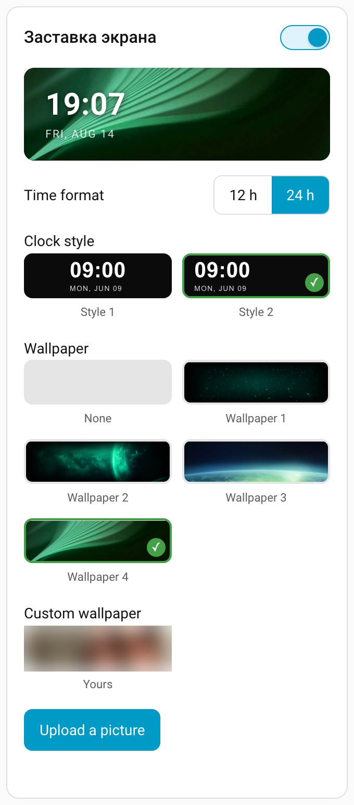
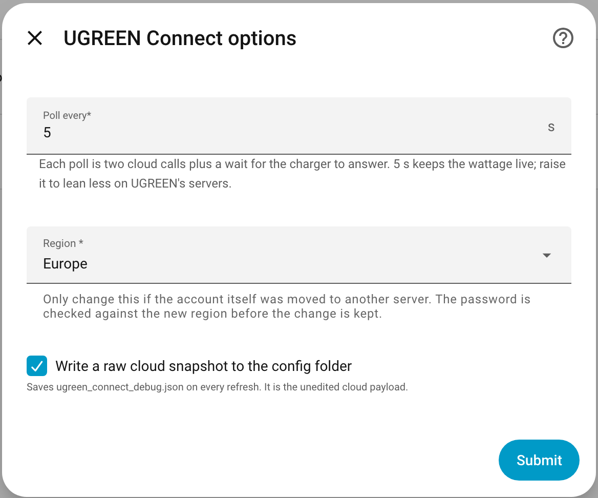

# UGREEN Connect for Home Assistant

Home Assistant integration for chargers managed by the **UgreenConnect** app
(`*.ugreeniot.com`). Developed against a **UGREEN Nexode Pro X783**.

Live per-port **voltage, current and power**, plus everything the app's screen
settings can do: brightness, screen-off time, charging mode, and the whole
screensaver — clock style, time format and wallpaper, your own included.



*That dashboard is [`docs/dashboard.yaml`](docs/dashboard.yaml) — one screenful,
ready to paste.*

> Not affiliated with, endorsed by, or supported by UGREEN. Trademarks belong to
> their respective owners.

## Why it exists

The charger has **no local API at all** — a full TCP 1–65535 scan finds nothing
open, and there is no mDNS or SSDP. Its only outbound path is its own cloud.
Local control exists solely over BLE. So a cloud integration is the only way to
get readings into Home Assistant without a Bluetooth proxy next to the device.

## Install

**HACS** → three-dot menu → *Custom repositories* → add `s1mptom/ugreen_connect`
as type *Integration* → install → **restart Home Assistant** → *Settings →
Devices & Services → Add integration → UGREEN Connect*.

Manual: copy `custom_components/ugreen_connect` into your `config/` and restart.

Sign in with your normal UGREEN account e-mail and password, and pick the region
your account belongs to — the same one the app shows. Accounts are not shared
between regions.

Requires Home Assistant **2024.7** or newer.

## What you get

Entity ids below are written `<device>`; in practice that is the charger's name,
e.g. `sensor.ugreen_nexode_pro_x783_c1_power`.

### Readings

| Entity | Notes |
|---|---|
| `sensor.<device>_c1_power` … `_dc_power` | one per port: C1–C6, A1, DC |
| `sensor.<device>_c1_voltage`, `_c1_current` | same ports |
| `sensor.<device>_c1_protocol` | negotiated fast-charge protocol: PD, PPS, QC, AFC, FCP, UFCS, AVS |
| `sensor.<device>_total_power` | sum across ports; firmware and Wi-Fi SSID in its attributes |
| `sensor.<device>_cloud_status` | `online` / `offline`; MAC in its attributes |
| `update.<device>_firmware` | installed version, and whether one is waiting |

### Controls

| Entity | Values |
|---|---|
| `number.<device>_screen_brightness` | 0–100 % |
| `select.<device>_screen_off_time` | 1, 5, 10, 30 minutes, or always on |
| `select.<device>_charging_mode` | adaptive power, thermal safe, DC turbo, priority |
| `switch.<device>_screensaver` | the clock the screen shows once it sleeps |
| `select.<device>_time_format` | 12- or 24-hour |
| `select.<device>_clock_style` | the two faces the charger draws |
| `select.<device>_wallpaper` | any picture in your UGREEN library, or none |

The choices match the app's own, and every write is read back from the device on
the next poll rather than assumed.

`custom` is a real charging mode and is reported when the device is in it, but it
cannot be selected here: it needs the 35 parameter bytes the presets leave at
zero, which only the app's mode editor fills in.

Ports are reported in the order `C1 C2 C3 C4 C5 C6 A1 DC`. A port keeps its
entities once it has been seen, so unplugging a cable does not delete its
history.

**What the device does not offer.** Its TSL model declares `WiFiRSSI`,
`errorCode`, `IPAddress` and more, but the X783 never populates them — asking
for those identifiers returns the same four properties it always reports. There
is no temperature sensor of any kind, and no energy total, so the charger cannot
feed Home Assistant's Energy dashboard directly (a Riemann-sum helper over
`total_power` is the usual workaround).

## The screensaver card

The entities above are enough to automate with, but the screensaver is easier to
set the way the app sets it: one panel, with a live preview of the strip the
charger will actually show.



The card is **served by the integration itself**, so there is nothing to add in
HACS and no resource to register — install the integration, restart, and the
card is available. Add it to a dashboard with *Add card → Manual*:

```yaml
type: custom:ugreen-wallpaper-card
```

That is the whole configuration for a single charger. With more than one, name
the device:

```yaml
type: custom:ugreen-wallpaper-card
device_id: 0123456789abcdef0123456789abcdef   # Settings → Devices → your charger, from the URL
title: Screensaver                            # optional; the card's heading
```

| Option | Default | Meaning |
|---|---|---|
| `device_id` | first charger found | which charger the card controls |
| `title` | `Screensaver` | heading next to the on/off switch |

Turning the switch off hides the settings, exactly as the app does — there is
nothing to configure while the screensaver is off.

**If the card does not appear** after installing, reload the browser with a hard
refresh (Ctrl/Cmd + Shift + R). The dashboard can render once before the
integration has finished starting, and shows *Configuration error* until the
page is loaded again.

### Your own wallpaper

*Upload a picture* opens a crop window over the photo you choose — drag, zoom
and rotate under it. The screen is **560 × 170**, wide enough that a photo almost
never suits it as taken, and zoom cannot go below the size that fills the window,
so a wallpaper never ends up with empty edges.

The charger keeps **one** slot of its own alongside the built-in pictures, so
uploading replaces whatever custom picture it was holding.

For automations there is a service taking a local `path`, a `url`, or base64 in
`image`:

```yaml
action: ugreen_connect.set_wallpaper
data:
  device_id: 0123456789abcdef0123456789abcdef
  path: /config/www/desk.jpg
```

Pictures given to the service, rather than to the card, are cover-cropped from
the centre.

Uploading needs **Pillow**, which any Home Assistant with `default_config`
already has. Everything else in the integration works without it.

## How it works

Two clouds are involved.

**Account API** (`api2.ugreeniot.com` for Europe). Credentials are sent inside an
RSA envelope: `getSidInfo` hands out a short-lived `sid` plus an RSA-2048 public
key, the whole login body is encrypted with PKCS#1 v1.5 and posted as
`{data, sid}`. This yields the account access token and the device inventory.

**RTCX/Polaris gateway** (`eu-gateway.ugreeniot.com`) carries telemetry. It wants
its own token, obtained by trading a one-time OAuth code:

```
GET  /app/v1/variety/getAppInfo?platform=rtcx  -> appKey, appSecret, oauthClientId, authFlag
POST /app/v1/oauth/authorize                   -> data.code            (single use)
POST /client/account/third/login               -> data.accessToken     (the iotToken, 24 h)
```

The gateway login's `password` field carries **that OAuth code**, not the user's
password — `pwdType: "4"`, `accountType: "6"`. Gateway requests are signed
Alibaba-API-Gateway style: `HMAC-SHA256(appSecret, stringToSign)` in
`x-ca-signature`, over `x-ca-key`, `x-ca-nonce` and `x-ca-timestamp`.

`appKey`/`appSecret` are **fetched at runtime under your own account** and are
not embedded in this repository.

### The charger's binary protocol

Readings are not exposed as named properties. The device tunnels a small binary
protocol through a single property, `PT_data`:

```
TYPE(1) CMD(1) LEN(2, big endian) PAYLOAD(LEN) CRC16(2)
TYPE: 0xAA query   0xEE device notify   0x11 setting
CRC:  CRC-16/MODBUS, low byte first
```

Writing a query frame to `PT_data` (`thing/properties/set`) makes the device
answer; the reply becomes the property's value, read back with
`thing/properties/get/all`. `GET_POWER_INFO` (`0xAA 0x06`) answers with eight
7-byte port records:

| offset | field | encoding |
|---|---|---|
| `7*i + 0` | voltage | U16 big endian, tenths of a volt |
| `7*i + 2` | current | U16 big endian, tenths of an amp |
| `7*i + 4` | power | U16 big endian, tenths of a watt |
| `56 + i` | handshake protocol | U8 |

Since the property retains its last value indefinitely, readings older than five
minutes are treated as "no reading" rather than as live. A reply is waited for by
polling until the frame is the one that was asked for, because until then the
property still holds the previous command's answer.

Wallpapers are the one thing not sent as bytes. The picture is uploaded to
UGREEN's own storage (`upload-pre-info` → presigned `PUT` → `wallPaper/save`) and
the charger is then handed the resulting id and URL through a `PIC_data`
property, which is what makes it download the file.

## Settings

*Settings → Devices & Services → UGREEN Connect → the cog on the account row*:



| Setting | Default | Notes |
|---|---|---|
| Poll every | 5 s | each poll is two cloud calls plus a wait for the charger to answer |
| Region | as set up | only if the account itself moved servers; the password is re-checked first |
| Debug snapshot | off | writes the unedited cloud payload to `ugreen_connect_debug.json` |

Five seconds keeps the wattage live enough to watch a laptop charge. It is also
a lot of traffic against someone else's API, so raise it if you would rather be
gentle — nothing else depends on the rate.

## Translating

Everything the integration says goes through
`custom_components/ugreen_connect/translations/`. Copy `en.json`, name it for
your language, translate the values, and open a pull request. Only English and
Russian exist so far.

The dashboard card keeps its own text in one table at the top of
`www/ugreen-wallpaper-card.js`: copy the `en` block, key it by language code,
and translate. Missing keys fall back to English, so a partial translation is
fine.

## Limitations

- **Cloud polling only**, five seconds apart by default — see *Settings* above.
- Logging in from the app with the same account can invalidate the integration's
  token. It re-authenticates on rejection, so this is self-healing.
- Per-port switching (`SET_PORT_CONTROL`) and the `custom` charging-mode editor
  are decoded but not exposed. `FACTORY_RESET` is deliberately left out.
- Settings changed from the phone app show up here on the next poll, wallpapers
  included: a picture uploaded there is named and previewed within a minute,
  because an id the library cannot account for sends the integration to read it
  again. The reverse is not true — **the app caches**, and keeps showing its old
  value until it is force-stopped and reopened.

## Contributing

Issues and pull requests are welcome, especially from owners of other UGREEN
chargers — the port table and the byte offsets in `const.py` and `rtcx.py` are
X783-specific and are the first thing another model will disagree about. A
diagnostics download (*Settings → Devices & Services → UGREEN Connect →
Download diagnostics*) is the most useful thing to attach; it has credentials
redacted.

## Legal

Written for interoperability, using the exception in Directive 2009/24/EC Art. 6
(UK: CDPA s.50B). No UGREEN code is redistributed, and no credentials of theirs
are embedded. MIT licensed.
