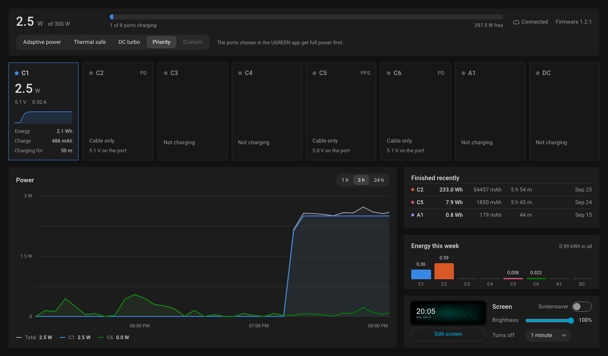
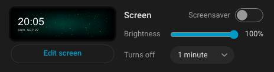
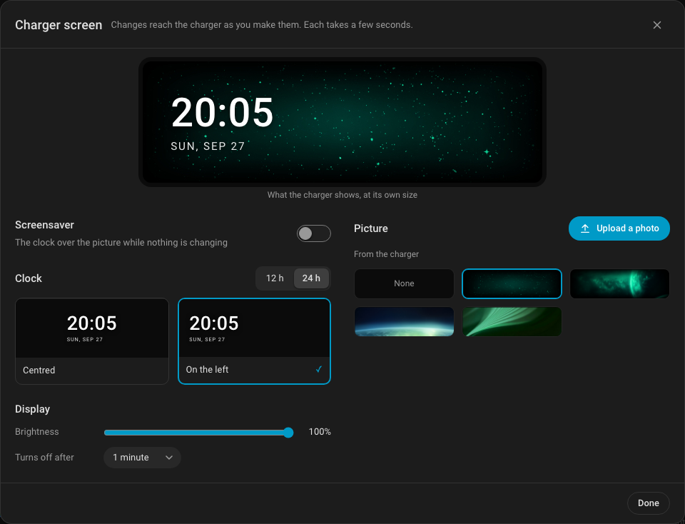
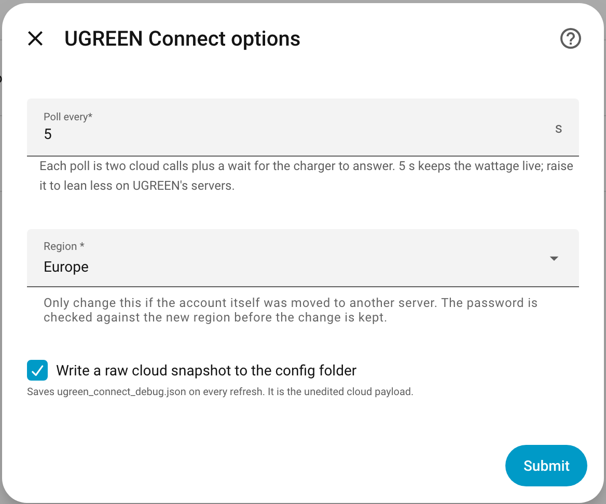

# UGREEN Connect for Home Assistant

Home Assistant integration for chargers managed by the **UgreenConnect** app
(`*.ugreeniot.com`). Developed against a **UGREEN Nexode Pro 300W (X783)** —
sold as the *Nexode Pro Smart Display Desktop Charger, 300W, 8-Port, GaN*.
`X783` is the code the app knows it by, and the one that turns up in entity ids;
it is not printed on the box.

Live per-port **voltage, current and power**, plus everything the app's screen
settings can do: brightness, screen-off time, charging mode, and the whole
screensaver — clock style, time format and wallpaper, your own included.



*That dashboard is [`docs/dashboard.yaml`](docs/dashboard.yaml) — one screenful,
ready to paste. Its power-history card is `statistics-graph-chart-card` from
HACS; without it that one card shows an error and everything else still works,
so delete it or swap in the built-in `history-graph`.*

> Not affiliated with, endorsed by, or supported by UGREEN. Trademarks belong to
> their respective owners.

## Why it exists

The charger has **no local API at all** — a full TCP 1–65535 scan finds nothing
open, and there is no mDNS or SSDP. Its only outbound path is its own cloud.
Local control exists solely over BLE. So a cloud integration is the only way to
get readings into Home Assistant without a Bluetooth proxy next to the device.

## Install

**HACS** → three-dot menu → *Custom repositories* → add `s1mptom/ugreen_connect`
as type *Integration* → install → **restart Home Assistant** → *Settings →
Devices & Services → Add integration → UGREEN Connect*.

Manual: copy `custom_components/ugreen_connect` into your `config/` and restart.

Sign in with your normal UGREEN account e-mail and password, and pick the region
your account belongs to — the same one the app shows. Accounts are not shared
between regions.

With more than one charger on the account, the next step lists them: tick the
ones to add. Each is read as its own model, which the account names, so a 160W
beside a 300W needs nothing set by hand. Change the choice later under
*Configure*: unticking a charger removes its device and entities. A charger
bound to the account afterwards is not added by itself; Home Assistant raises a
repair notice saying it is there, and it shows up unticked under *Configure*.

Requires Home Assistant **2024.7** or newer.

## What you get

Entity ids below are written `<device>`; in practice that is the charger's name,
e.g. `sensor.ugreen_nexode_pro_x783_c1_power`.

### Readings

| Entity | Notes |
|---|---|
| `sensor.<device>_c1_power` … | one per port the charger reports; a 300W's are C1–C6, A1, DC |
| `sensor.<device>_c1_voltage`, `_c1_current` | same ports |
| `sensor.<device>_c1_protocol` | negotiated fast-charge protocol: PD, PPS, QC, AFC, FCP, UFCS, AVS |
| `sensor.<device>_c1_session_energy` | watt-hours delivered to whatever is plugged into that port now |
| `sensor.<device>_c1_session_charge` | the same session read as milliamp-hours into a battery |
| `sensor.<device>_c1_energy`, `sensor.<device>_energy` | kilowatt-hours since the counter began, per port and for the charger. Integrated here, since the device keeps no total of its own; feed the Energy dashboard one or the other, never both |
| `binary_sensor.<device>_c1_charging` | whether charge is flowing on that port right now, which is a different question from whether a session is open -- seconds apart when the cable is pulled, and close to two hours apart when a full device is left plugged in |
| `event.<device>_c1_charging` | `started` and `ended`, with `energy_wh`, `duration`, `peak_power` and `protocol` on the event |
| `sensor.<device>_total_power` | sum across ports; firmware and Wi-Fi SSID in its attributes |
| `sensor.<device>_cloud_status` | `online` / `offline`; MAC in its attributes |
| `sensor.<device>_c1_custom_mode_limit` … | six of them -- C1–C5 and C6+A, which share one -- reading the watt limit that group is set to. Diagnostic; created the first time the charger is seen in the `custom` charging mode, and unavailable while any other one runs. The protocols the group may negotiate and the raw mask are attributes |
| `update.<device>_firmware` | installed version, and whether one is waiting |

### Controls

| Entity | Values |
|---|---|
| `number.<device>_screen_brightness` | 0–100 % |
| `select.<device>_screen_off_time` | 1, 5, 10, 30 minutes, or always on |
| `select.<device>_charging_mode` | adaptive power, thermal safe, DC turbo, priority; a 160W, which has no DC port, offers adaptive power, thermal safe and priority |
| `switch.<device>_screensaver` | the clock the screen shows once it sleeps |
| `switch.<device>_c1_charged_first` … | C1, C2 and C3: whether the `priority` mode charges that port first. Any of them, all three included, but never none -- turning off the last one is refused. Unavailable under any other mode |
| `select.<device>_dc_port_voltage` | 12, 15 or 20 V: what DC turbo gives the DC port. Unavailable under any other mode |
| `switch.<device>_dc_always_on` | whether DC turbo keeps the DC port live with nothing plugged in. Unavailable under any other mode |
| `select.<device>_time_format` | 12- or 24-hour |
| `select.<device>_clock_style` | the two faces the charger draws |
| `select.<device>_wallpaper` | any picture in your UGREEN library, or none |
| `switch.<device>_c_cable_output` … | a 160W's port switches: C-Cable, C1, and C2 & A, which the app switches together. Shown, not set yet: the app switches them with a command nobody has watched go out |

The choices match the app's own, and nothing here shows a value because it was
asked for: a write is followed by a read of the charger, and what comes back is
what the entity publishes. A setting the charger declines -- and it does decline
some -- leaves the control where it was rather than moving and springing back.

`custom` is a real charging mode and is reported when the device is in it, but it
cannot be selected here: setting a mode carries that mode's parameter block, and
only the app's editor can compose a custom one. Home Assistant replays a block it
has watched the charger running; the only block it ever composes is an empty one,
for a mode it has not seen. The bytes it changes are the priority ports'
mask, the first of the block under `priority`, and under `dc_turbo` the DC
voltage and Always On, the first two -- each the only byte that moves when that
control is changed in the app.

**DC turbo turns USB ports off.** At 12 or 15 V only C1–C3 keep charging beside
the DC port, and at 20 V none of the USB ports do. That is how the
[Notebookcheck review](https://www.notebookcheck.net/Powerful-fast-charging-hub-with-DC-port-Ugreen-Nexode-Pro-300W-Desktop-Charger-review.1370087.0.html)
describes this charger, and what an X783 did here: C5 went dark the moment DC
turbo came on at 12 V, and came back seconds after the mode was changed again.
C1 went dark too, both times DC turbo was switched on, although it is one of
the three that should stay on. Once its device came back by itself after the
mode was changed again, and once it had not several minutes later. So a device
that was charging when DC turbo came on may need to be plugged in again. The
charger card says which ports are off beside the voltage, and their tiles say so too.

That applies to the presets too. A mode carries its own settings — `priority`
keeps a mask of its priority ports there, DC Turbo its port voltage and its
Always On switch — and the charger holds no
copy, so the write is what decides them. Once a mode has been seen running it is
remembered, across restarts, and put back whenever it is selected.

Before it has been seen, selecting it sends empty parameters, and the charger
either loses what that mode was configured with or refuses the change outright —
DC Turbo does the latter, so it simply will not switch. The log says so when it
happens. If the settings are gone, set that mode up again in the app; if the
change did not take, select the mode in the app. Either way leave the charger in
it for a minute or so — that is the soonest its settings are read again, and on a
slow poll interval it is longer.

A 300W reports its ports in the order `C1 C2 C3 C4 C5 C6 A1 DC`, and a 160W as
`C-Cable C1 C2 A`; the order comes from a table keyed on `productNo`, and a
model with no entry gets `P1..Pn` counted from the report's own length. A port
keeps its entities once it has been seen, so unplugging a cable does not delete
its history.

### Charging sessions

A session is a *bout of charging*: it starts when current begins to flow and its
total stays on screen afterwards, so *how much did that get?* is still answerable
once the phone is back in your pocket. The next bout starts a new session from zero.
Both session sensors carry the same detail in their attributes: `charging`,
`started`, `ended`, `duration`, `peak_power`, `average_power`, `last_draw` and
`protocol`.

It is a bout rather than the span between plugging in and unplugging because **this
charger cannot tell you a device has been removed.** It holds the port live and keeps
the negotiated USB-PD contract alive with nothing but a cable in the socket — 5 V and
`PD`, indistinguishable from an attached device that is not currently drawing. The
report's per-port occupancy byte says "present" for a bare cable too. So the end of a
session is decided by the current going away and staying away, which is what
*Session ends after* configures; a port that does report itself empty — some do —
ends its session at once instead of waiting that out.

That setting is a real trade-off, and the right value depends on what lives on the
port. A phone left at 100% tops itself up every so often, and those sips have to land
inside the same session, or a 5 mAh trickle would start a "new session" and the charge
that actually went into the phone would disappear off the card. The two-hour default
clears that comfortably. The cost is at the other end: two devices swapped on the same
cable less than two hours apart are counted as one session.

The charger reports no energy total, so this is integrated from the per-port
wattage, and three things about the device shape how:

- **Watt-hours are the measurement; milliamp-hours are a conversion.** A port may
  be handing over 5, 9 or 28 V, so the charge that reaches a battery depends on
  that battery's own voltage — which the charger cannot know. Set it under
  *Battery voltage* in the options; the 3.85 V default suits phones and earbuds
  and is meaningless for a laptop.
- **The cloud drops out for minutes at a time.** An outage leaves a session
  exactly as it was rather than reading as an unplug, and the missing minutes are
  not filled in with the last known wattage.
- **Neither current nor power can be trusted on its own.** A full device still
  reports the 0.1 A measurement quantum, which at 9 V looks like 0.9 W and would
  invent close to a whole battery over a night; a bare cable produces the mirror
  image, a stray 0.3 A that the charger itself reports as 0.0 W. Charge counts as
  flowing only when both are above their floors: 0.15 A and 0.5 W.

Sessions survive a restart of Home Assistant. If the device on the port changed
while it was down, or the downtime outlasted the idle window, the old total is
left as it was rather than added to.

**What the device does not offer.** Its TSL model declares `WiFiRSSI`,
`errorCode`, `IPAddress` and more, but this charger never populates them — asking
for those identifiers returns the same four properties it always reports. There
is no temperature sensor of any kind, and no energy total of its own -- the
charger reports watts and nothing else. The **Energy** sensors integrate those
readings here instead, one per port and one for the charger, so the Energy
dashboard can be fed without a Riemann-sum helper. Take the ports or the
charger, not both: together they count every watt-hour twice.

## The cards

These ship with the integration and are registered for you, so there is nothing
to install and no resource to add by hand. Each finds the charger's entities
itself. With two or more chargers, a card without `device_id` shows the first,
and the dashboard card lets you switch; give a card `device_id` to pin it to one.

| Card | What it draws |
|---|---|
| `custom:ugreen-charger-card` | the total out of the charger's budget, cut into the ports drawing it; the charging mode and what it does -- in `priority`, the ports it charges first, to pick from; in DC turbo, the DC port's voltage and Always On, and which USB ports that turns off; in `custom`, its limits; cloud and firmware |
| `custom:ugreen-ports-card` | one tile per port, in the order they sit on the charger: watts, volts, amps, protocol, a line of the last hour, what the current charge has put in, a *First* badge on the ports `priority` charges first, and *Off in DC turbo* on the ports DC turbo turns off |
| `custom:ugreen-sessions-card` | the charges that have finished, newest first, one row per port |
| `custom:ugreen-power-card` | power over the last hour, three hours or day, per port and in total, read from the recorder |
| `custom:ugreen-energy-card` | kilowatt-hours per port for a day, a week, a month or all time |
| `custom:ugreen-wallpaper-card` | the charger's screen: screensaver, brightness and screen-off, with an editor for the clock and the picture |
| `custom:ugreen-dashboard-card` | all of the above as one screen, for a view given over to the charger. With several chargers and no `device_id`, the chosen one's name heads the screen, with the others in a list behind it |

A port keeps one colour on every card, picked to stay apart in light and dark
themes and for common kinds of colour blindness; a theme can set
`--ugreen-port-color-1` to `-8` to change them. Times follow the 12- or 24-hour
choice in your Home Assistant profile. A control moved on a card holds its new
value until the charger confirms it rather than springing back mid-write, which
for this charger takes a few seconds.

Two ways to put them up. [`docs/dashboard.yaml`](docs/dashboard.yaml) lays them
out in sections, the one to take if the charger shares its dashboard with
anything else. If it does not,
[`docs/dashboard-panel.yaml`](docs/dashboard-panel.yaml) hands the whole view to
`ugreen-dashboard-card`: the budget across the top, the ports as tiles under
it, and the chart with the finished sessions, the week's energy and the screen
beside it. On a narrower screen it folds to one column, and the tiles go four
to a row, then two.

## The screen card

The entities are enough to automate with, but the screen is easier to set the
way the app sets it. The card shows the strip as the charger will show it, with
the screensaver, the brightness and how soon the screen goes dark; **Edit
screen** opens an editor over the page, with the strip at the charger's own
size, the clock's style and format, the pictures the charger carries and your
own, and an upload.





The card is **served by the integration itself**, so there is nothing to add in
HACS and no resource to register. Add it to a dashboard with *Add card →
Manual*:

```yaml
type: custom:ugreen-wallpaper-card
```

That is the whole configuration for a single charger. With more than one, name
the device:

```yaml
type: custom:ugreen-wallpaper-card
device_id: 0123456789abcdef0123456789abcdef   # Settings → Devices → your charger, from the URL
title: Screen                                 # optional; the card's heading
```

| Option | Default | Meaning |
|---|---|---|
| `device_id` | first charger found | which charger the card controls |
| `title` | `Screen` | the card's heading |

**If a card does not appear** right after installing, load the page once more:
a dashboard drawn while Home Assistant was still starting can have asked for
the cards before they were being served. After an update there is nothing to
clear -- the cards' address changes with their contents, so a browser cannot
keep showing the old ones.

### Your own wallpaper

*Upload a photo* opens a fitting step: the screen's frame over the photo you
chose, which you drag, zoom and turn under it — to any angle, with the slider
or with two fingers on a phone — while a preview shows it as the charger will.
The screen is **560 × 170**, wide enough that a photo almost never suits it as
taken, and the zoom cannot go below what keeps the frame covered at the angle
you set, so a wallpaper never ends up with a blank corner. Nothing is sent until
you press *Use this photo*.

The charger keeps **one** slot of its own alongside the built-in pictures, so
uploading replaces whatever custom picture it was holding.

For automations there is a service taking a local `path`, a `url`, or base64 in
`image`:

```yaml
action: ugreen_connect.set_wallpaper
data:
  device_id: 0123456789abcdef0123456789abcdef
  path: /config/www/desk.jpg
```

Pictures given to the service, rather than to the card, are cover-cropped from
the centre.

Uploading needs **Pillow**, which any Home Assistant with `default_config`
already has. Everything else in the integration works without it.

## How it works

Two clouds are involved.

**Account API** (`api2.ugreeniot.com` for Europe). Credentials are sent inside an
RSA envelope: `getSidInfo` hands out a short-lived `sid` plus an RSA-2048 public
key, the whole login body is encrypted with PKCS#1 v1.5 and posted as
`{data, sid}`. This yields the account access token and the device inventory.

**RTCX/Polaris gateway** (`eu-gateway.ugreeniot.com`) carries telemetry. It wants
its own token, obtained by trading a one-time OAuth code:

```
GET  /app/v1/variety/getAppInfo?platform=rtcx  -> appKey, appSecret, oauthClientId, authFlag
POST /app/v1/oauth/authorize                   -> data.code            (single use)
POST /client/account/third/login               -> data.accessToken     (the iotToken, 24 h)
```

The gateway login's `password` field carries **that OAuth code**, not the user's
password — `pwdType: "4"`, `accountType: "6"`. Gateway requests are signed
Alibaba-API-Gateway style: `HMAC-SHA256(appSecret, stringToSign)` in
`x-ca-signature`, over `x-ca-key`, `x-ca-nonce` and `x-ca-timestamp`.

`appKey`/`appSecret` are **fetched at runtime under your own account** and are
not embedded in this repository.

### The charger's binary protocol

Readings are not exposed as named properties. The device tunnels a small binary
protocol through a single property, `PT_data`:

```
TYPE(1) CMD(1) LEN(2, big endian) PAYLOAD(LEN) CRC16(2)
TYPE: 0xAA query   0xEE device notify   0x11 setting
CRC:  CRC-16/MODBUS, low byte first
```

Writing a query frame to `PT_data` (`thing/properties/set`) makes the device
answer; the reply becomes the property's value, read back with
`thing/properties/get/all`. `GET_POWER_INFO` (`0xAA 0x06`) answers with one
7-byte record per port -- eight on a 300W, four on a 160W:

| offset | field | encoding |
|---|---|---|
| `7*i + 0` | voltage | U16 big endian, tenths of a volt |
| `7*i + 2` | current | U16 big endian, tenths of an amp |
| `7*i + 4` | power | U16 big endian, tenths of a watt |
| `56 + i` | handshake protocol | U8 |

Since the property retains its last value indefinitely, readings older than five
minutes are treated as "no reading" rather than as live. A reply is waited for by
polling until the frame is the one that was asked for, because until then the
property still holds the previous command's answer.

Wallpapers are the one thing not sent as bytes. The picture is uploaded to
UGREEN's own storage (`upload-pre-info` → presigned `PUT` → `wallPaper/save`) and
the charger is then handed the resulting id and URL through a `PIC_data`
property, which is what makes it download the file.

## Settings

*Settings → Devices & Services → UGREEN Connect → the cog on the account row*:



| Setting | Default | Notes |
|---|---|---|
| Poll every | 5 s | how often a reading arrives, measured start to start; the wait for the charger to answer comes out of it, not on top |
| Battery voltage | 3.85 V | only used to read a session's watt-hours back as milliamp-hours; a laptop's pack is far higher |
| Charging efficiency | 90 % | how much of what leaves the port reaches the cell; the rest is heat |
| Session ends after | 120 min | how long a port must deliver nothing before its charging session is finished; see [Charging sessions](#charging-sessions) for the trade-off |
| Region | as set up | only if the account itself moved servers; the password is re-checked first |
| Debug snapshot | off | writes the unedited cloud payload to `ugreen_connect_debug.json` |

Five seconds keeps the wattage live enough to watch a laptop charge. It is also
a lot of traffic against someone else's API, so raise it if you would rather be
gentle — nothing else depends on the rate.

## Tests

Two suites, split by what they need.

`tests/` needs no Home Assistant at all. It holds the session rules -- what starts
a bout, what ends it, what a dropout means -- the frame parsing and rebuilding,
and a set of checks that read the source rather than run it, for the properties
that fail silently: that a field the setup form asks for is a field something
uses, that a frame is never written without holding the charger's one slot, that
each language's refusal names the mode its own select shows.

```
pip install pytest && pytest tests -q
```

`tests_ha/` starts Home Assistant with the integration, a fake cloud account and a
fake charger, and checks the wiring: entities appearing and disappearing, a write
reaching the client and the reading that comes back, a poll racing a write. It
needs `pytest-homeassistant-custom-component`, which pins one exact Home Assistant
version, so CI runs it inside that release's own container.

What neither can say anything about is the charger. Every frame decoded here was
read off one, and the byte offsets in `protocol.py` were settled by changing a
setting in the app and watching which byte moved -- so a change to them is
checked against hardware before it lands, not against a fixture.

## Translating

Everything the integration says goes through
`custom_components/ugreen_connect/translations/`. Copy `en.json`, name it for
your language, translate the values, and open a pull request. English, German
and Russian exist so far.

The dashboard card keeps its own text in one table at the top of
`www/ugreen-wallpaper-card.js`: copy the `en` block, key it by language code,
and translate. Missing keys fall back to English, so a partial translation is
fine.

## Limitations

- **Cloud polling only**, five seconds apart by default — see *Settings* above.
- Logging in from the app with the same account can invalidate the integration's
  token. It re-authenticates on rejection, so this is self-healing.
- Per-port switching (`SET_PORT_CONTROL`) is decoded but not exposed. The
  `custom` charging mode is read and shown -- one sensor per port group,
  created the first time the charger is seen in that mode and unavailable
  while any other one runs -- but not writable: nothing here writes this
  block. Replaying it whole is safe, and the charger accepts a one-field edit,
  but the app can change a group's protocol mask along with its limit, and
  which mask goes with which limit is not mapped, so setting one limit on its
  own could leave a pair the app never sends.
  `FACTORY_RESET` is deliberately left out.
- Settings changed from the phone app show up here on the next poll, wallpapers
  included: a picture uploaded there is named and previewed within a minute,
  because an id the library cannot account for sends the integration to read it
  again. The reverse is not true — **the app caches**, and keeps showing its old
  value until it is force-stopped and reopened.

## Credits

Eighteen of the changes here are [@lukislp](https://github.com/lukislp)'s: the
German translation, the port count read from the report rather than assumed, the
model remembered across restarts, the per-field writability that lets a second
model be understood a byte at a time, the charging sensors and events that
publish the session tracker's verdict rather than its ingredients, the Energy
counters, the `custom` mode decoded and reported, and the read-back that made
every control publish what the charger did rather than what it was asked. Also
the reviews, which caught rather more of mine than the other way round.

The 160W's field offsets came from its owner in
[#2](https://github.com/s1mptom/ugreen_connect/issues/2), mapped one setting at a
time on hardware nobody here has: its screen settings, its own numbering of the
charging modes, its port switches and its picture library.

## Contributing

Issues and pull requests are welcome, especially from owners of other UGREEN
chargers — the port table in `protocol.py` covers the two models anyone has
measured, and the byte offsets beside it are the 300W's, which is the first
thing another model will disagree about. A
diagnostics download (*Settings → Devices & Services → UGREEN Connect →
Download diagnostics*) is the most useful thing to attach; it has credentials
redacted.

### Mapping a setting on your charger

Settings live at byte offsets in the charger's state reply. To find one, change
it in the UGREEN app and see which byte moves. The integration records this for
you.

1. Open *Settings → Devices & Services → UGREEN Connect* and choose **Enable
   debug logging**. While it is on, the charger's state is read on every poll,
   about every five seconds, instead of once a minute, even with nothing
   plugged in.
2. In the UGREEN app, change **one** setting. Write down what you changed and
   to what, for example "brightness 100 → 37". Wait ten seconds before
   changing the next one.
3. Choose **Download diagnostics** on the same page. The file has the last 60
   changes under `state_changes`: when each one happened, the charging mode,
   and which bytes moved, such as `[5, "02", "05"]` (byte 5 went from 02 to 05).
4. Choose **Disable debug logging**. Home Assistant then downloads its log;
   you can keep it or delete it (see below).
5. Attach the diagnostics file and your notes to an issue. Your notes are what
   match each change to a setting.

To map the ports instead, plug one device in at a time and download the
diagnostics after each. The file has the latest power report under `frames`,
and the port record that has values is the port you used.

**What is safe to post.** The diagnostics file has the account, your
charger's serial, cloud id and MAC, the name you gave it, your Wi-Fi name, and
the links to and file names of your pictures removed. What is left is the
model, the firmware, the readings, the charger's own bytes and the ids of your
pictures.

The log Home Assistant downloads is **its whole log**, with every other
integration's messages in it. Post it only if you are asked to. Before you do,
keep only this integration's own lines, the ones with
`[custom_components.ugreen_connect` in them. A text editor's search works, or
on a terminal:

    grep -F '[custom_components.ugreen_connect' home-assistant_*.log

That leaves out Home Assistant's own lines about the integration too, which is
on purpose: they can name the account by its e-mail, since that is the title
of its entry. In this integration's lines, your e-mail, password and user id,
your charger's serial, cloud id and MAC, and your Wi-Fi name are replaced: a
charger becomes a tag such as `charger 3fa9c1`, the rest `<account>`, `<mac>`,
`<wifi>` and so on. A value that could be an ordinary word or number, such as
a Wi-Fi name `Home` or `1402`, is not replaced as a word, since that would
rewrite every "Home Assistant" too and give the name away.

Do not post `ugreen_connect_debug.json` from the *Debug snapshot* option. It is
the unedited cloud payload, written for this integration's own development,
and it has all of the above in it.

## Legal

Written for interoperability, using the exception in Directive 2009/24/EC Art. 6
(UK: CDPA s.50B). No UGREEN code is redistributed, and no credentials of theirs
are embedded. MIT licensed.
